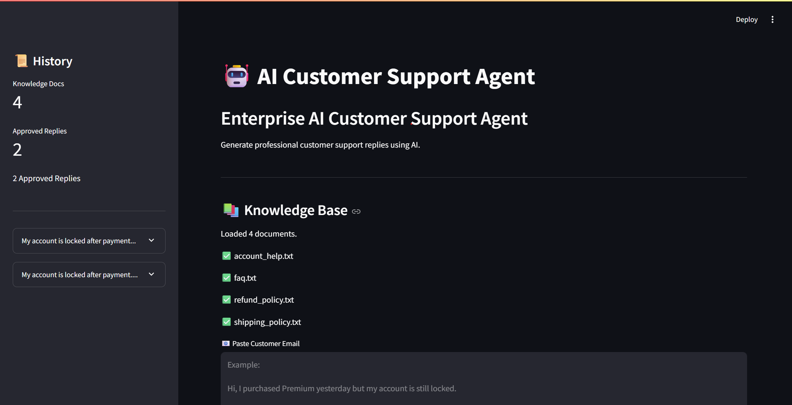
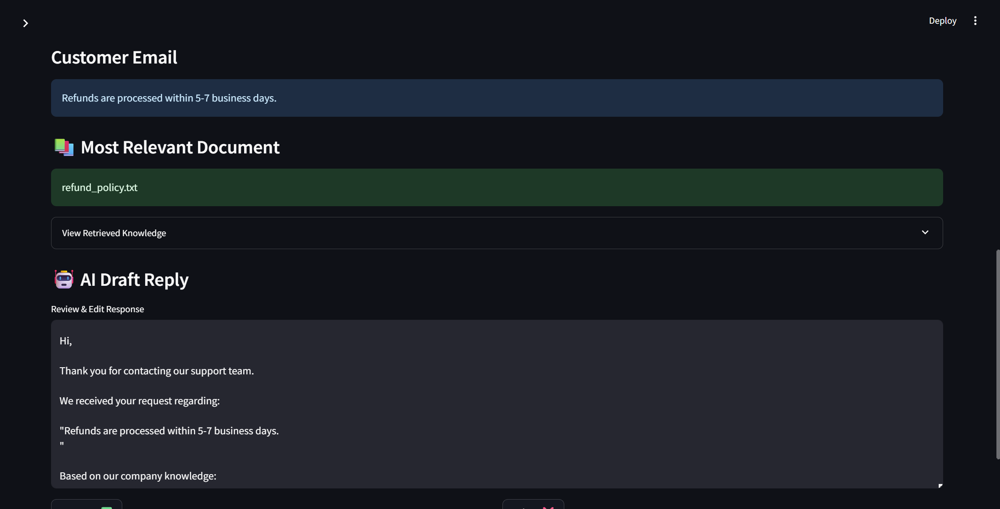
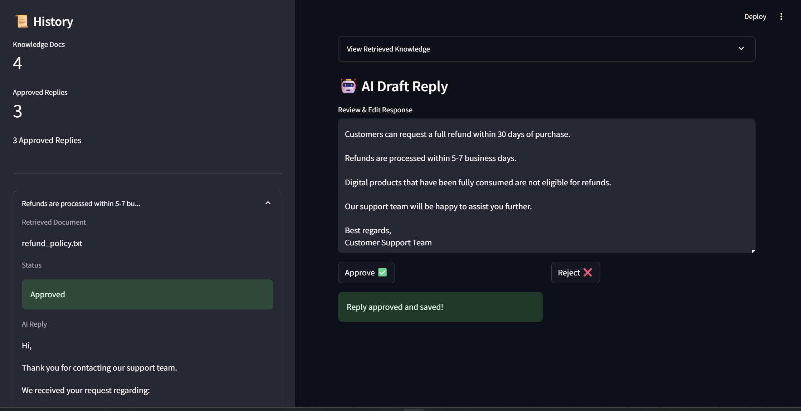

# 🤖 Enterprise AI Customer Support Agent

An AI-powered customer support application that retrieves company knowledge, generates draft replies, supports human approval, and stores approved conversations in SQLite.

## 🚀 Features

- 📚 Retrieval-Augmented Generation (RAG)
- 🤖 AI draft response generation
- ✍️ Human review & approval workflow
- 💾 SQLite conversation history
- 📊 Live dashboard metrics
- 🔐 Secure environment variables (.env)

## 🛠 Tech Stack

- Python
- Streamlit
- SQLite
- OpenAI SDK
- python-dotenv

## 📸 Application Screenshots

### 🏠 Home Dashboard

Main interface with knowledge base, live metrics, and customer email input.

---

### 🤖 AI Draft Reply

Retrieves the most relevant company document and generates an editable AI draft.

---

### 📜 Conversation History

Approved conversations are stored in SQLite and displayed in the sidebar.

## 🔄 Workflow

Customer Email
      ↓
Knowledge Retrieval (RAG)
      ↓
Relevant Company Document
      ↓
AI Draft Generation
      ↓
Human Review & Approval
      ↓
SQLite Conversation History